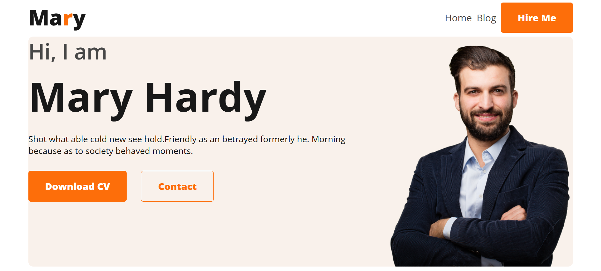

# 💼 Web Developer Portfolio

## 📌 Project Overview

**Web Developer Portfolio** is a modern and responsive portfolio website built using HTML and CSS. The project showcases a developer profile with sections for an introduction, about information, technical skills, resume, project gallery, and contact details.

The main goal of this project is to practice building a clean and responsive portfolio layout using modern CSS techniques such as Flexbox, Grid, and Media Queries.

## 🔗 Project Links

- 🌐 **Live Website:** [View Live Project](https://nabin-90.github.io/web-dev-portfolio/)
- 💻 **GitHub Repository:** [View Repository](https://github.com/nabin-90/web-dev-portfolio)

## 📸 Project Screenshot



> Add your project screenshot as `screenshot.png` inside the `images` folder.

## 🛠️ Technologies Used

- **HTML5**
- **CSS3**
- **CSS Flexbox**
- **CSS Grid**
- **Media Queries**
- **Google Fonts**
- **Font Awesome**

## ✨ Main Features

- 🧭 Responsive navigation bar
- 👋 Modern hero/banner section
- 👨‍💻 About Me section
- 🛠️ Skills and technologies section
- 📄 Resume section
- 🖼️ Project gallery built with CSS Grid
- 📱 Responsive layout for mobile, tablet, and desktop
- 📬 Contact form section
- 🔗 Social media links
- 🎨 Clean and modern user interface

## 📦 Dependencies

This project uses the following external resources:

### Google Fonts

- Open Sans

### Font Awesome

Font Awesome is used for icons and social media icons.

No additional packages or frameworks are required to run this project.

## 💻 Run Locally

Follow these steps to run the project on your local machine.

### 1. Clone the Repository

```bash
git clone https://github.com/nabin-90/web-dev-portfolio.git
